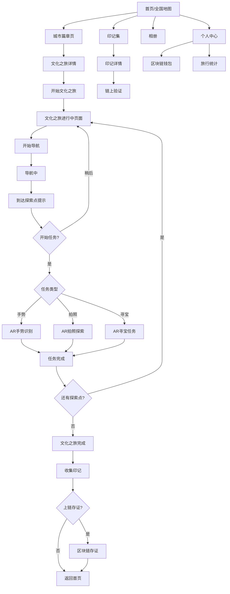
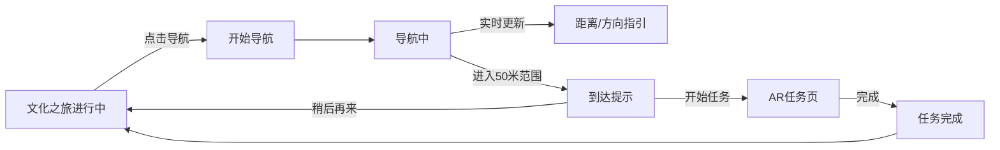
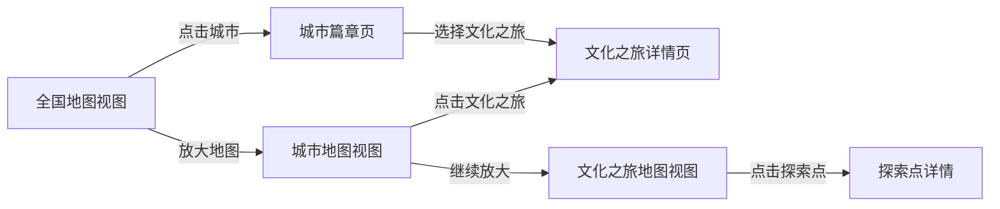

# 寻印 - 界面线框图

## 1. 首页/发现页（全屏沉浸式地图）

```
┌─────────────────────────────────────┐
│                               ┌───┐ │
│                               │👤│ │
│   [全屏插画风格中国地图]       ├───┤ │
│                               │🏆│ │
│    🏔️哈尔滨    ⛩️北京          ├───┤ │
│         🦌        🏛️西安       │📷│ │
│    🐼成都    🌸杭州 ←你        ├───┤ │
│         🌶️重庆  🏯长沙         │🎵│ │
│              🌴广州            ├───┤ │
│    🌺昆明     🌃深圳           │📍│ │
│                               └───┘ │
│                                     │
│   各城市用特色插画图标标注          │
│   点击城市 → 底部弹出城市面板       │
│                                     │
└─────────────────────────────────────┘
  （全屏无遮挡，无顶部搜索栏）

地图浮动控件（右侧竖排）：
┌───┐
│👤│ 我的 - 进入个人中心
├───┤
│🏆│ 印记 - 进入印记集
├───┤
│📷│ 相册 - 进入探索照片集
├───┤
│🎵│ 音乐 - 背景音乐开关
├───┤
│📍│ 定位 - 快速定位到当前位置
└───┘
```

## 1.1 点击城市后 - 底部弹出面板（Bottom Sheet）

```
┌─────────────────────────────────────┐
│                               ┌───┐ │
│                               │👤│ │
│   [地图 - 聚焦到杭州]          ├───┤ │
│                               │🏆│ │
│         🌸杭州                 ├───┤ │
│           ↓                   │📷│ │
│                               ├───┤ │
│                               │🎵│ │
│                               ├───┤ │
│                               │📍│ │
│                               └───┘ │
├─────────────────────────────────────┤
│  杭州 · 文化之书               🔍   │
│  👥 3569人探索过                    │
├─────────────────────────────────────┤
│  [华东] [华南] [华北] [西南] [海外]→│
├─────────────────────────────────────┤
│  ┌───────────────┐ ┌───────────────┐│
│  │ 西湖十景      │ │ 龙井茶道      ││
│  │ 0.5km        │ │ 2.1km        ││
│  │ 江南水乡文化  │ │ 茶文化体验    ││
│  │ ⭐⭐⭐⭐⭐ 10点 │ │ ⭐⭐⭐⭐ 6点   ││
│  └───────────────┘ └───────────────┘│
│                                     │
│  ┌─────────────────────────────────┐│
│  │        [ 发现更多文化之旅 ]      ││
│  └─────────────────────────────────┘│
└─────────────────────────────────────┘

底部面板交互说明：
- 点击城市图标后从底部弹出
- 可上滑展开查看更多文化之旅
- 下滑或点击地图空白处收起
- 省份标签横向滚动，快速切换区域
- 🔍 图标点击可搜索具体景点
```

## 1.2 底部面板展开状态（上滑后）

```
┌─────────────────────────────────────┐
│  [地图缩小显示]               ┌───┐ │
│                               │...│ │
│                               └───┘ │
├─────────────────────────────────────┤
│  ─  （拖动条）                      │
├─────────────────────────────────────┤
│  杭州 · 文化之书               🔍   │
│  👥 3569人探索过 | 📍 3条文化之旅   │
├─────────────────────────────────────┤
│  [华东] [华南] [华北] [西南] [海外]→│
├─────────────────────────────────────┤
│                                     │
│  ┌─────────────────────────────────┐│
│  │  [城市封面插画]                  ││
│  │                                 ││
│  │  杭州，古称临安，是中国七大      ││
│  │  古都之一。西湖文化、茶文化、    ││
│  │  丝绸文化在此交融...             ││
│  └─────────────────────────────────┘│
│                                     │
│  ─────── 文化之旅 ───────           │
│                                     │
│  ┌─────────────────────────────────┐│
│  │ 🏯 西湖十景文化之旅    0.5km    ││
│  │ ⭐⭐⭐⭐⭐ | 10探索点 | 3小时     ││
│  │ 白蛇传说 · 断桥残雪              ││
│  │ 👥 1,234人完成                   ││
│  └─────────────────────────────────┘│
│                                     │
│  ┌─────────────────────────────────┐│
│  │ 🍵 龙井茶文化之旅      2.1km    ││
│  │ ⭐⭐⭐⭐ | 6探索点 | 2小时        ││
│  │ 茶道体验 · 采茶制茶              ││
│  │ 👥 856人完成                     ││
│  └─────────────────────────────────┘│
│                                     │
│  ┌─────────────────────────────────┐│
│  │ 🔒 南宋御街历史探秘    [未解锁] ││
│  │ 完成前2条文化之旅后解锁          ││
│  └─────────────────────────────────┘│
│                                     │
└─────────────────────────────────────┘
```

## 2. 文化之旅详情页

```
┌─────────────────────────────────────┐
│  ←  西湖十景文化之旅                 │
├─────────────────────────────────────┤
│  ┌─────────────────────────────────┐│
│  │     [文化之旅封面图/主题图]      ││
│  └─────────────────────────────────┘│
│                                     │
│  位置: 杭州西湖风景区                │
│  主题：江南水乡文化                  │
│  预计时长：3小时                     │
│  总距离：5.2公里                     │
│  已有 1,234 人完成                   │
│                                     │
│  ─────── 探索点列表 ───────         │
│                                     │
│  ┌─────────────────────────────────┐│
│  │ 1. 断桥残雪              [导航] ││
│  │    拍照任务 · 500m               ││
│  │    "在断桥上与白娘子合影"        ││
│  └─────────────────────────────────┘│
│  ┌─────────────────────────────────┐│
│  │ 2. 平湖秋月              [导航] ││
│  │    AR手势 · 800m                 ││
│  │    "比出赏月的手势"              ││
│  └─────────────────────────────────┘│
│  ┌─────────────────────────────────┐│
│  │ 3. 雷峰夕照              [导航] ││
│  │    AR寻宝 · 1.2km                ││
│  │    "找到隐藏的法海"              ││
│  └─────────────────────────────────┘│
│                                     │
│  ┌─────────────────────────────────┐│
│  │        [ 开始这条文化之旅 ]      ││
│  └─────────────────────────────────┘│
└─────────────────────────────────────┘
```

## 2.1 文化之旅进行中页面（地图+导航）

```
┌─────────────────────────────────────┐
│  ×  西湖十景文化之旅     进度 1/10  │
├─────────────────────────────────────┤
│                                     │
│  ┌─────────────────────────────────┐│
│  │                                 ││
│  │    [ 高德地图 - 路线视图 ]       ││
│  │                                 ││
│  │    ·1 断桥残雪 (当前目标)        ││
│  │     \                           ││
│  │      ·2 平湖秋月                 ││
│  │       \                         ││
│  │        ·3 雷峰夕照               ││
│  │                                 ││
│  │    你 ←                         ││
│  │                                 ││
│  └─────────────────────────────────┘│
│                                     │
│  ┌─────────────────────────────────┐│
│  │  下一个探索点                    ││
│  │  1. 断桥残雪                     ││
│  │  距离：500m  |  步行约6分钟      ││
│  │                                 ││
│  │  ┌───────────────────────────┐  ││
│  │  │      [ 开始导航 ]          │  ││
│  │  └───────────────────────────┘  ││
│  └─────────────────────────────────┘│
│                                     │
│  ─────── 探索点列表 ───────         │
│  ○ 1. 断桥残雪 - 500m               │
│  ○ 2. 平湖秋月 - 1.3km              │
│  ○ 3. 雷峰夕照 - 2.5km              │
│  ...                                │
│                                     │
└─────────────────────────────────────┘
```

## 2.2 导航中页面

```
┌─────────────────────────────────────┐
│  ×  导航到：断桥残雪                 │
├─────────────────────────────────────┤
│                                     │
│  ┌─────────────────────────────────┐│
│  │                                 ││
│  │    [ 高德地图 - 导航视图 ]       ││
│  │                                 ││
│  │         ↑                       ││
│  │         |                       ││
│  │    ─────┼─────                  ││
│  │         |                       ││
│  │         ·  目的地               ││
│  │                                 ││
│  │    你 ←                         ││
│  │                                 ││
│  └─────────────────────────────────┘│
│                                     │
│  ┌─────────────────────────────────┐│
│  │                                 ││
│  │     ↑ 前方 100米 右转            ││
│  │                                 ││
│  │  ───────────────────────────    ││
│  │                                 ││
│  │  剩余距离：350m                  ││
│  │  预计到达：4分钟                 ││
│  │                                 ││
│  └─────────────────────────────────┘│
│                                     │
│  ┌─────────────────────────────────┐│
│  │         [ 结束导航 ]             ││
│  └─────────────────────────────────┘│
│                                     │
└─────────────────────────────────────┘
```

## 2.3 到达探索点提示

```
┌─────────────────────────────────────┐
│                                     │
│  ┌─────────────────────────────────┐│
│  │                                 ││
│  │    [ 高德地图 - 当前位置 ]       ││
│  │                                 ││
│  │         ·  探索点               ││
│  │        /|\                      ││
│  │       / | \  50米范围           ││
│  │      /  |  \                    ││
│  │         你                      ││
│  │                                 ││
│  └─────────────────────────────────┘│
│                                     │
│  ┌─────────────────────────────────┐│
│  │                                 ││
│  │     你已到达探索点！             ││
│  │                                 ││
│  │     1. 断桥残雪                  ││
│  │     拍照任务                     ││
│  │     "在断桥上与白娘子合影"       ││
│  │                                 ││
│  └─────────────────────────────────┘│
│                                     │
│  ┌─────────────────────────────────┐│
│  │        [ 开始任务 ]              ││
│  └─────────────────────────────────┘│
│                                     │
│  ┌─────────────────────────────────┐│
│  │        [ 稍后再来 ]              ││
│  └─────────────────────────────────┘│
│                                     │
└─────────────────────────────────────┘
```

## 3. AR任务页 - 手势识别

```
┌─────────────────────────────────────┐
│  ×                    探索点 2/10   │
├─────────────────────────────────────┤
│  ┌─────────────────────────────────┐│
│  │                                 ││
│  │      [ AR 相机实时画面 ]        ││
│  │                                 ││
│  │         ┌───────┐               ││
│  │         │ 月亮  │ AR锚点        ││
│  │         └───────┘               ││
│  │                                 ││
│  │    ┌─────────────────┐          ││
│  │    │   目标手势      │          ││
│  │    │   "赏月手势"    │          ││
│  │    └─────────────────┘          ││
│  │                                 ││
│  └─────────────────────────────────┘│
│                                     │
│  ┌─────────────────────────────────┐│
│  │  平湖秋月                        ││
│  │  请对准AR锚点，比出赏月手势      ││
│  │                                 ││
│  │  ████████░░░░░░░░  识别中 60%   ││
│  └─────────────────────────────────┘│
│                                     │
│  ┌─────────────────────────────────┐│
│  │         [ 拍照确认 ]             ││
│  └─────────────────────────────────┘│
└─────────────────────────────────────┘
```

## 4. AR任务页 - 拍照探索

```
┌─────────────────────────────────────┐
│  ×                    探索点 1/10   │
├─────────────────────────────────────┤
│  ┌─────────────────────────────────┐│
│  │                                 ││
│  │      [ AR 相机实时画面 ]        ││
│  │                                 ││
│  │    ┌─────────────────┐          ││
│  │    │   白娘子        │ AR虚拟   ││
│  │    │   (虚拟形象)    │ 角色     ││
│  │    └─────────────────┘          ││
│  │                                 ││
│  │         断桥 (实景)              ││
│  │                                 ││
│  └─────────────────────────────────┘│
│                                     │
│  ┌─────────────────────────────────┐│
│  │  与白娘子合影                    ││
│  │  站在断桥上，与AR白娘子合影      ││
│  │                                 ││
│  │  提示：可以选择不同滤镜          ││
│  └─────────────────────────────────┘│
│                                     │
│  滤镜：[古风] [水墨] [原图]         │
│                                     │
│  ┌─────────────────────────────────┐│
│  │         [ 拍照 ]                 ││
│  └─────────────────────────────────┘│
└─────────────────────────────────────┘
```

## 5. 任务完成页

```
┌─────────────────────────────────────┐
│                                     │
│              恭喜！                  │
│         任务完成！                   │
│                                     │
│  ┌─────────────────────────────────┐│
│  │      [你拍摄的照片]              ││
│  └─────────────────────────────────┘│
│                                     │
│         断桥残雪 探索成功            │
│                                     │
│  ┌─────────────────────────────────┐│
│  │  收集奖励                        ││
│  │  +50 积分                        ││
│  └─────────────────────────────────┘│
│                                     │
│  ─────── 文化小知识 ───────         │
│  ┌─────────────────────────────────┐│
│  │  断桥残雪是西湖十景之一，        ││
│  │  因《白蛇传》中许仙与白娘子      ││
│  │  在此相遇而闻名...               ││
│  │                    [发现更多 >] ││
│  └─────────────────────────────────┘│
│                                     │
│  ┌───────────────┐ ┌───────────────┐│
│  │   分享到社交   │ │  继续下一个   ││
│  └───────────────┘ └───────────────┘│
└─────────────────────────────────────┘
```

## 6. 文化之旅完成页 - 收集印记

```
┌─────────────────────────────────────┐
│                                     │
│         恭喜完成文化之旅！           │
│                                     │
│  ┌─────────────────────────────────┐│
│  │         ┌─────────┐             ││
│  │         │ 西湖    │             ││
│  │         │ 十景    │  印记       ││
│  │         │         │             ││
│  │         │ 2024.01 │             ││
│  │         └─────────┘             ││
│  │                                 ││
│  │    西湖十景文化之旅              ││
│  │    完成时间：2024-01-15         ││
│  │    用时：2小时45分               ││
│  └─────────────────────────────────┘│
│                                     │
│  ┌─────────────────────────────────┐│
│  │  收集奖励                        ││
│  │  +500 积分                       ││
│  │  +1 路线印记                     ││
│  │  解锁「西湖文化达人」称号        ││
│  └─────────────────────────────────┘│
│                                     │
│  ┌─────────────────────────────────┐│
│  │  上链存证                        ││
│  │  将此印记永久记录到区块链        ││
│  │  收集不可篡改的完成证明          ││
│  │           [ 立即上链 ]           ││
│  └─────────────────────────────────┘│
│                                     │
│  ┌───────────────┐ ┌───────────────┐│
│  │   分享印记     │ │  返回首页     ││
│  └───────────────┘ └───────────────┘│
└─────────────────────────────────────┘
```

## 7. 印记集页（从浮动控件进入）

```
┌─────────────────────────────────────┐
│  ←  我的印记集                 筛选 │
├─────────────────────────────────────┤
│  ┌─────────────────────────────────┐│
│  │  📊 收集进度                     ││
│  │  路线印记: 12/100 ████░░░░░░    ││
│  │  城市印记: 3/50   ██░░░░░░░░    ││
│  │  特殊印记: 5/30   ███░░░░░░░    ││
│  │  已上链: 8                       ││
│  └─────────────────────────────────┘│
│                                     │
│  ─────── 路线印记 ───────           │
│                                     │
│  ┌───────┐ ┌───────┐ ┌───────┐     │
│  │ 🏯    │ │ 🏔️    │ │ ⛩️    │     │
│  │西湖   │ │黄山   │ │京都   │     │
│  │十景   │ │云海   │ │祇园   │     │
│  │       │ │       │ │       │     │
│  │🔗已上链│ │🔗已上链│ │ 未上链 │     │
│  └───────┘ └───────┘ └───────┘     │
│                                     │
│  ─────── 城市印记 ───────           │
│                                     │
│  ┌───────┐ ┌───────┐ ┌───────┐     │
│  │ 🌆    │ │ 🔒    │ │ 🔒    │     │
│  │ 杭州  │ │ ???  │ │ ???  │     │
│  │ 全通  │ │ 未解锁 │ │ 未解锁 │     │
│  │🔗已上链│ │       │ │       │     │
│  └───────┘ └───────┘ └───────┘     │
│                                     │
│  ─────── 特殊印记 ───────           │
│                                     │
│  ┌───────┐ ┌───────┐ ┌───────┐     │
│  │ 🌸    │ │ ⚡    │ │ 🔒    │     │
│  │樱花   │ │速通   │ │ ???  │     │
│  │季限定 │ │达人   │ │ 隐藏  │     │
│  │ 未上链 │ │ 未上链 │ │ 未解锁 │     │
│  └───────┘ └───────┘ └───────┘     │
│                                     │
│  ─────── 进行中的文化之旅 ───────   │
│  ┌─────────────────────────────────┐│
│  │ 🗼 上海外滩文化之旅              ││
│  │ ████████░░░░  进度 7/10         ││
│  │                    [继续 >]     ││
│  └─────────────────────────────────┘│
│                                     │
└─────────────────────────────────────┘
```

## 8. 印记详情页（含区块链存证）

```
┌─────────────────────────────────────┐
│  ←  印记详情                        │
├─────────────────────────────────────┤
│                                     │
│         ┌─────────────┐             │
│         │   西湖      │             │
│         │   十景      │             │
│         │             │             │
│         │  2024.01.15 │             │
│         └─────────────┘             │
│                                     │
│  西湖十景文化之旅                    │
│  5星文化之旅                         │
│                                     │
│  ─────── 完成信息 ───────           │
│  完成时间：2024-01-15 14:32         │
│  用时：2小时45分                     │
│  探索点：10/10                       │
│                                     │
│  ─────── 区块链存证 ───────         │
│  ┌─────────────────────────────────┐│
│  │  已上链                          ││
│  │                                 ││
│  │  链：Polygon                    ││
│  │  交易哈希：0x7f3a...8b2c        ││
│  │  区块高度：45,678,901           ││
│  │  时间戳：2024-01-15 14:35:22    ││
│  │                                 ││
│  │  [复制哈希] [链上发现]           ││
│  └─────────────────────────────────┘│
│                                     │
│  ─────── 探索照片 ───────           │
│  ┌─────┐ ┌─────┐ ┌─────┐ ┌─────┐   │
│  │ 照片 │ │ 照片 │ │ 照片 │ │ +7  │   │
│  └─────┘ └─────┘ └─────┘ └─────┘   │
│                                     │
│  ┌─────────────────────────────────┐│
│  │         [ 分享印记 ]             ││
│  └─────────────────────────────────┘│
└─────────────────────────────────────┘
```

## 9. 相册页（从发现页右上角进入）

```
┌─────────────────────────────────────┐
│  ←  我的相册                   筛选 │
├─────────────────────────────────────┤
│  ┌─────────────────────────────────┐│
│  │  统计                            ││
│  │  总照片: 86  |  文化之旅: 12    ││
│  └─────────────────────────────────┘│
│                                     │
│  ─────── 按文化之旅分类 ───────     │
│                                     │
│  ┌─────────────────────────────────┐│
│  │ 西湖十景文化之旅   10张 >       ││
│  │ ┌─────┐ ┌─────┐ ┌─────┐        ││
│  │ │ 照片 │ │ 照片 │ │ 照片 │        ││
│  │ └─────┘ └─────┘ └─────┘        ││
│  └─────────────────────────────────┘│
│                                     │
│  ┌─────────────────────────────────┐│
│  │ 龙井茶文化之旅     6张 >        ││
│  │ ┌─────┐ ┌─────┐ ┌─────┐        ││
│  │ │ 照片 │ │ 照片 │ │ 照片 │        ││
│  │ └─────┘ └─────┘ └─────┘        ││
│  └─────────────────────────────────┘│
│                                     │
│  ┌─────────────────────────────────┐│
│  │ 黄山云海探秘       8张 >        ││
│  │ ┌─────┐ ┌─────┐ ┌─────┐        ││
│  │ │ 照片 │ │ 照片 │ │ 照片 │        ││
│  │ └─────┘ └─────┘ └─────┘        ││
│  └─────────────────────────────────┘│
│                                     │
│  ─────── 按时间线 ───────           │
│                                     │
│  2024年1月                          │
│  ┌─────┐ ┌─────┐ ┌─────┐ ┌─────┐   │
│  │ 照片 │ │ 照片 │ │ 照片 │ │ 照片 │   │
│  └─────┘ └─────┘ └─────┘ └─────┘   │
│                                     │
└─────────────────────────────────────┘
```

## 10. 个人中心页（从浮动控件进入）

```
┌─────────────────────────────────────┐
│  ←  个人中心                   设置 │
├─────────────────────────────────────┤
│                                     │
│  ┌─────────────────────────────────┐│
│  │  ┌─────┐                        ││
│  │  │ 头像 │  旅行者小明            ││
│  │  │     │  ID: 12345678          ││
│  │  └─────┘  🏅 西湖文化达人        ││
│  └─────────────────────────────────┘│
│                                     │
│  ┌─────────────────────────────────┐│
│  │   3/50      12/100     8        ││
│  │  城市解锁   印记收集   已上链    ││
│  │  ██░░░░    ███░░░░░            ││
│  └─────────────────────────────────┘│
│                                     │
│  ─────── 功能菜单 ───────           │
│                                     │
│  ┌─────────────────────────────────┐│
│  │  🏆  我的印记集              >  ││
│  ├─────────────────────────────────┤│
│  │  📸  我的相册                >  ││
│  ├─────────────────────────────────┤│
│  │  🔗  区块链钱包              >  ││
│  ├─────────────────────────────────┤│
│  │  📊  旅行统计                >  ││
│  ├─────────────────────────────────┤│
│  │  🎁  积分商城                >  ││
│  ├─────────────────────────────────┤│
│  │  ⚙️  设置                    >  ││
│  └─────────────────────────────────┘│
│                                     │
│  ─────── 最近动态 ───────           │
│  ┌─────────────────────────────────┐│
│  │  🎉 收集「西湖十景」路线印记    ││
│  │     2024-01-15                  ││
│  └─────────────────────────────────┘│
│                                     │
└─────────────────────────────────────┘
```

## 页面流程图



## 导航流程图



## 地图交互流程图



## 核心交互说明

### 1. 全屏沉浸式设计
- 无底部导航栏，无顶部搜索栏，地图完全全屏
- 所有功能通过右侧浮动控件触达
- 点击城市后底部弹出面板（Bottom Sheet），不跳转页面
- 更有"探索世界"的沉浸感，符合"文化之书"设计理念

### 1.1 地图浮动控件（右侧竖排，从上到下）
- 👤 我的：进入个人中心（账户、设置、统计等）
- 🏆 印记：进入印记集（路线印记、城市印记、特殊印记）
- 📷 相册：进入探索照片集（按文化之旅/时间分类）
- 🎵 音乐：背景音乐开关（点击切换播放/暂停，图标状态变化）
- 📍 定位：快速定位到当前位置

### 1.2 底部弹出面板（Bottom Sheet）交互
- 点击城市图标后从底部弹出，地图聚焦到该城市
- 默认显示半屏，展示城市简介和文化之旅列表
- 上滑可展开全屏，查看更多详情
- 下滑或点击地图空白处收起面板
- 省份标签横向滚动，可快速切换区域
- 面板内🔍图标可搜索具体景点

### 1.3 背景音乐系统
- **首页默认**：播放轻柔古风BGM，营造文化氛围
- **城市面板弹出**：切换为该城市特色音乐（如杭州播江南丝竹、西安播秦腔元素）
- **文化之旅进行中**：播放与主题匹配的背景音乐
- **用户控制**：浮动控件音乐按钮可随时开关，记住用户偏好

### 2. 地图与城市交互
- **全屏插画地图**：用插画风格展示全国城市，无顶部搜索栏遮挡
- **底部弹出面板**：点击城市后底部弹出面板，展示城市详情和文化之旅
- **文化之旅导航**：选择文化之旅后切换到高德SDK进行实际导航
- **实时定位**：显示用户当前位置
- **App内导航**：点击"导航"按钮启动步行导航
- **到达提示**：进入探索点50米范围自动弹出提示

### 3. 进度展示系统
- **底部面板进度**：城市面板内显示"文化之旅解锁进度 2/3"
- **印记进度**：印记集页面显示各类印记的收集进度条
- **进度条可视化**：用进度条直观展示完成度，激励用户继续探索

### 4. AR任务交互
- 相机画面实时显示
- AR锚点悬浮在真实场景中
- 手势识别实时反馈匹配度
- 拍照支持AR滤镜叠加

### 5. 印记收集交互
- 印记以卡片形式展示，分为路线印记、城市印记、特殊印记三类
- 已上链印记有特殊标识（🔗）
- 未解锁印记显示为锁定状态（🔒）
- 点击可发现详情和链上证明
- 支持分享到社交平台

### 6. 印记类型说明
- **路线印记**：完成一条文化之旅收集
- **城市印记**：完成某城市所有文化之旅收集
- **特殊印记**：达成特定条件收集（如首次完成、节日限定、速通等）

### 7. 设计理念
- **书本式篇章**：每个城市是一本"文化之书"，增加收藏感和仪式感
- **进度激励**：通过进度展示激励用户继续探索
- **真实体验**：强调实地旅行的价值，而非虚拟游戏化
- **文化深度**：每个探索点都有文化内容，不是简单打卡
